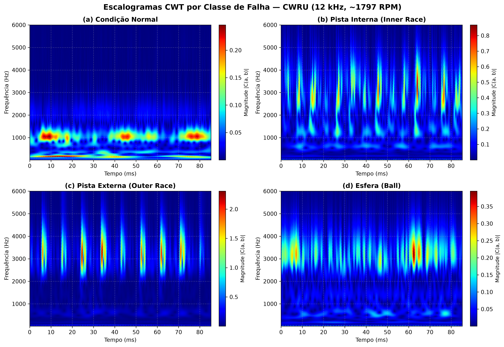
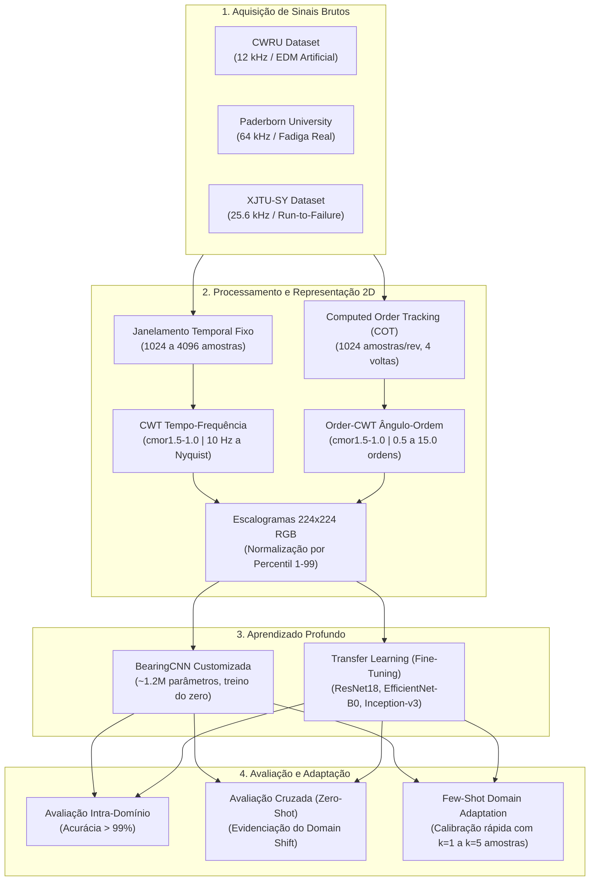
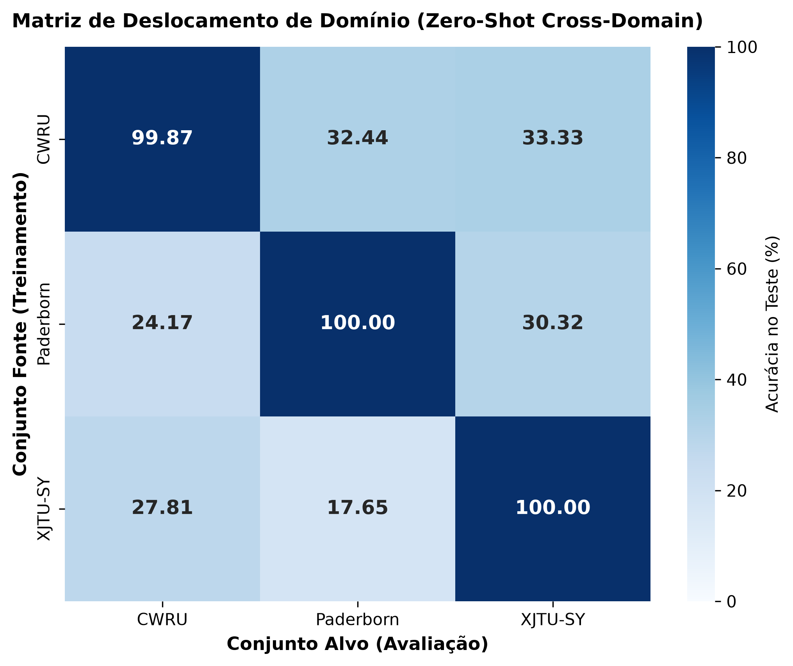
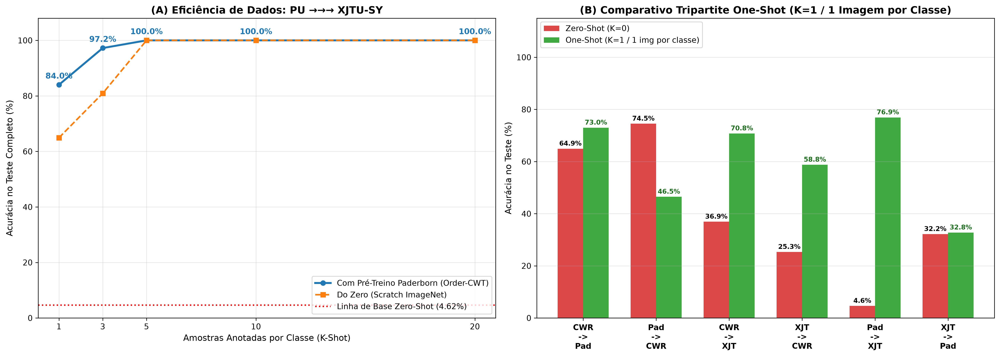

# Diagnóstico de Falhas em Rolamentos com CWT, Computed Order Tracking e Deep Learning

Transformada Wavelet Contínua (CWT), *Computed Order Tracking* (COT) e Redes Neurais Convolucionais aplicadas ao diagnóstico precoce de falhas em mancais de rolamento sob variações de velocidade, geometria e severidade operacional.

[](https://www.python.org/)
[](https://pytorch.org/)
[](https://engineering.case.edu/bearingdatacenter)
[](LICENSE)

---

## Sumário

- [Visão Geral](#visão-geral)
- [Bancos de Dados Analisados (Benchmark Tripartite)](#bancos-de-dados-analisados-benchmark-tripartite)
- [Justificativa Técnica: CWT vs. STFT vs. FFT](#justificativa-técnica-cwt-vs-stft-vs-fft)
- [Computed Order Tracking (COT) e Invariância à Rotação](#computed-order-tracking-cot-e-invariância-à-rotação)
- [Escalogramas por Classe](#escalogramas-por-classe)
- [Pipeline do Sistema](#pipeline-do-sistema)
- [Resultados Intra-Domínio (In-Domain)](#resultados-intra-domínio-in-domain)
- [Avaliação Cruzada e Análise de Domain Shift (Cross-Domain)](#avaliação-cruzada-e-análise-de-domain-shift-cross-domain)
- [Adaptação de Domínio com Poucas Amostras (Few-Shot Domain Adaptation)](#adaptação-de-domínio-com-poucas-amostras-few-shot-domain-adaptation)
- [Estrutura do Repositório](#estrutura-do-repositório)
- [Instalação](#instalação)
- [Guia de Uso](#guia-de-uso)
- [Modelos de Deep Learning e Transfer Learning](#modelos-de-deep-learning-e-transfer-learning)
- [Base Teórica e Referências](#base-teórica-e-referências)
- [Roadmap do Projeto](#roadmap-do-projeto)
- [Autor e Licença](#autor-e-licença)

---

## Visão Geral

Mancais de rolamento respondem por mais de 40% das falhas catastróficas em máquinas elétricas rotativas industriais (motores de indução, geradores, bombas e compressores). O diagnóstico precoce dessas anomalias é um pilar indispensável para a manutenção preditiva da Indústria 4.0.

Este projeto desenvolve e valida experimentalmente uma metodologia robusta de diagnóstico que combina:

1. **Transformada Wavelet Contínua (CWT):** Mapeia os sinais temporais unidimensionais de vibração em escalogramas bidimensionais tempo-frequência (wavelet Morlet complexa), capturando com alta resolução eventos transitórios não estacionários provocados pelo choque dos elementos rolantes sobre descontinuidades mecânicas.
2. **Computed Order Tracking (COT):** Reamostra o sinal temporal para o domínio angular (amostras uniformes por revolução do eixo), gerando escalogramas no domínio de **Ângulo-Ordem (Order-CWT)**, eliminando a dependência do sinal em relação à velocidade de rotação (RPM).
3. **Deep Learning e Transfer Learning:** Classificação automática dos escalogramas via CNN customizada (*BearingCNN*, ~1.2M parâmetros) e modelos convolucionais pré-treinados no ImageNet (*ResNet-18*, *EfficientNet-B0*, *Inception-v3*).
4. **Estudo de Generalização Cruzada (*Domain Shift*):** Avaliação tripartite entre falhas artificiais usinadas em laboratório (**CWRU**) e falhas autênticas por fadiga mecânica acelerada (**Paderborn University** e **XJTU-SY**), comprovando a eficácia de *Few-Shot Domain Adaptation* para calibração industrial instantânea.

---

## Bancos de Dados Analisados (Benchmark Tripartite)

O projeto contempla três dos maiores e mais respeitados bancos de dados públicos da literatura internacional de prognóstico e saúde de máquinas (PHM):

| Característica | CWRU (EUA) | Paderborn University (Alemanha) | XJTU-SY (China) |
|---|:---:|:---:|:---:|
| **Rolamento Testado** | SKF 6205-2RS JEM | SKF 6203 | LDK UER204 |
| **Número de Esferas ($Z$)** | 9 esferas | **8 esferas** | **8 esferas** |
| **Ordem Pista Interna (BPFI)** | **5.41 ordens** | **4.95 ordens** | **4.92 ordens** ($\Delta = 0{,}03$) |
| **Ordem Pista Externa (BPFO)** | **3.58 ordens** | **3.05 ordens** | **3.08 ordens** ($\Delta = 0{,}03$) |
| **Taxa de Amostragem ($f_s$)** | 12.000 Hz | 64.000 Hz | 25.600 Hz |
| **Velocidade de Rotação** | ~1.797 RPM (variável) | 900 e 1.500 RPM | 2.100 e 2.250 RPM |
| **Natureza da Falha** | Artificial (eletroerosão EDM) | **Fadiga mecânica real acelerada** | **Fadiga real (*run-to-failure*)** |
| **Condições Avaliadas** | Normal, Pista Interna, Pista Externa, Esfera | Normal, Pista Interna, Pista Externa | Normal, Pista Interna, Pista Externa |

> [!TIP]
> **Compatibilidade Cinemática Paderborn $\leftrightarrow$ XJTU-SY:**  
> Ambos os rolamentos possuem exatamente 8 esferas e relações dimensionais que resultam em ordens de falha virtualmente idênticas ($\text{BPFI} \approx 4{,}9$ e $\text{BPFO} \approx 3{,}0$). Essa simetria geométrica é o alicerce ideal para validação de algoritmos de transferência de domínio entre máquinas reais.

---

## Justificativa Técnica: CWT vs. STFT vs. FFT

| Característica | FFT (Fourier Rápida) | STFT (Fourier de Janela Curta) | CWT (Wavelet Contínua) |
|---|:---:|:---:|:---:|
| **Domínio de Análise** | Frequência pura | Tempo-frequência | Tempo-frequência |
| **Janela de Ponderação** | Sinal inteiro (infinita) | Fixa no tempo e frequência | **Adaptativa multi-resolução** |
| **Resolução Temporal** | Nula | Constante | **Alta para frequências elevadas** |
| **Resolução Espectral** | Constante | Constante | **Alta para baixas frequências** |
| **Sinais Não Estacionários** | Inadequada | Parcialmente adequada | **Excelente (padrão-ouro)** |

Sinais de vibração decorrentes de falhas em rolamentos são inerentemente **não estacionários e impulsivos**. A CWT contorna o Princípio da Incerteza de Heisenberg-Gabor adaptando sua janela de análise através de operações de dilatação (*escala*) e translação (*tempo*), permitindo localizar no tempo pulsos transitórios de alta frequência e capturar harmônicos contínuos em baixa frequência.

<p align="center">
  
</p>
<p align="center"><sub>(a) Sinal de vibração bruto no domínio do tempo e (b) escalograma CWT correspondente com wavelet-mãe Morlet complexa (cmor1.5-1.0).</sub></p>

---

## Computed Order Tracking (COT) e Invariância à Rotação

Em aplicações industriais reais, a rotação do motor flutua devido a oscilações de carga e rede. No domínio do tempo, uma mudança de rotação comprime ou expande os pulsos, provocando dispersão espectral e falha catastrófica de modelos treinados em rotação fixa (*Domain Shift*).

O **Computed Order Tracking (COT)** reamostra o sinal temporal $x(t)$ para o domínio angular $x(\theta)$ através de interpolação cúbica baseada no vetor de rotação instantânea do eixo:
$$\Delta \theta = \frac{2\pi}{N_{\text{amostras/volta}}}$$

Ao aplicar a CWT no domínio angular, o eixo vertical passa de frequências em Hertz ($f$) para **Ordens de Rotação** ($O = f / f_r$). As frequências de defeito mecânico (BPFI, BPFO, BSF) tornam-se constantes puramente geométricas:

<p align="center">
  
</p>
<p align="center"><sub>Comparativo: no domínio do tempo (linha 1), a falha varia de 74 Hz a 160 Hz devido ao RPM. No domínio de Ordens (linha 2), ambos os sinais alinham-se na ordem geométrica correspondente (~5.0 ordens).</sub></p>

---

## Escalogramas por Classe

Cada topologia de falha gera padrões espectrais e assinaturas de textura singulares no escalograma bidimensional:

<p align="center">
  
</p>
<p align="center"><sub>Escalogramas CWT no padrão de publicação acadêmica (janelas de 85,3 ms a 12 kHz, ~1.797 RPM): (a) Condição Normal (baixa densidade espectral e ausência de impactos periódicos); (b) Falha na Pista Interna (impactos periódicos de alta frequência excitando a ressonância estrutural em ~3.000–4.500 Hz modulados pela rotação do eixo); (c) Falha na Pista Externa (pulsos periódicos repetitivos bem definidos na frequência BPFO); e (d) Falha na Esfera (modulação complexa decorrente do giro do elemento rolante e rotação da gaiola).</sub></p>

---

## Pipeline do Sistema



---

## Resultados Intra-Domínio (In-Domain)

Resultados obtidos em amostras inéditas de teste utilizando **particionamento estrito baseado em arquivos `.mat` e `.csv` originais** (eliminando qualquer possibilidade de vazamento de dados decorrente de sobreposição de janelas):

### 1. Benchmark CWRU (4 Classes: Normal, Pista Interna, Pista Externa, Esfera)
*2.368 amostras de teste a 12 kHz, $1.797\text{ RPM}$:*

| Modelo | Estratégia | Acurácia Multiclasse | Detecção Binária (Normal vs. Falha) | Parâmetros |
|---|---|:---:|:---:|:---:|
| **ResNet18** | Fine-Tuning (`Freeze=False`) | **99.87%** | **100.00%** | ~11.1M |
| **EfficientNet-B0** | Fine-Tuning (`Freeze=False`) | **98.86%** | **100.00%** | ~5.3M |
| **Inception-v3** | Fine-Tuning (`Freeze=False`) | **96.92%** | **100.00%** | ~23.8M |
| **BearingCNN (Própria)** | Treino do Zero | **95.69%** | **100.00%** | ~1.2M |

<p align="center">
  <b>Curvas de Aprendizado (Perda e Acurácia — ResNet-18)</b><br>
  
</p>

<p align="center">
  <b>Matriz de Confusão no Teste Inédito (ResNet-18 — 99.87% de Acurácia)</b><br>
  
</p>
<p align="center"><sub>Curvas de convergência de treino/validação com checkpointing automático e respectiva Matriz de Confusão da ResNet-18 no conjunto de teste do CWRU (apenas 3 erros em 2.368 predições).</sub></p>

### 2. Benchmark Paderborn University (3 Classes: Falhas Reais a 64 kHz)
*Amostras de teste com fadiga real por estresse mecânico acelerado (1.116 amostras):*
- **BearingCNN:** **99.91%** de acurácia no teste (`val_loss: 0.0024`, apenas 1 erro em 1.116 amostras).
- **ResNet-18:** **100.00%** de acurácia no teste.
- **EfficientNet-B0:** **100.00%** de acurácia no teste.
- **Inception-v3:** **100.00%** de acurácia no teste.

### 3. Benchmark XJTU-SY (3 Classes: Degradação Acelerada a 25.6 kHz)
*Amostras de teste obtidas em ensaios contínuos de run-to-failure (465 amostras):*
- **BearingCNN:** **100.00%** de acurácia no teste.
- **ResNet-18:** **100.00%** de acurácia no teste.
- **EfficientNet-B0:** **100.00%** de acurácia no teste.
- **Inception-v3:** **100.00%** de acurácia no teste.

---

## Avaliação Cruzada e Análise de Domain Shift (Cross-Domain)

Apesar dos resultados quase perfeitos obtidos em cada bancada individualmente (In-Domain > 99%), a transferência direta (*Zero-Shot Cross-Domain*) de um modelo treinado em um banco de dados para outro sofre com severa degradação devido a variações de velocidade (RPM), diâmetro de rolamento e condições de carga.

### 1. Matriz de Domain Shift no Tempo-Frequência (CWT Tradicional)
Transferência direta entre os 3 bancos de dados sem calibração prévia (*Zero-Shot*):

| Origem (Treino) | Destino: CWRU (12 kHz) | Destino: Paderborn (64 kHz) | Destino: XJTU-SY (25.6 kHz) |
|---|:---:|:---:|:---:|
| **CWRU** | *99.87% (In-Domain)* | **32.44%** | **33.33%** |
| **Paderborn** | **24.17%** | *100.00% (In-Domain)* | **30.32%** |
| **XJTU-SY** | **27.81%** | **17.65%** | *100.00% (In-Domain)* |

<p align="center">
  
</p>
<p align="center"><sub>Matriz de transferência cruzada 3x3 no domínio Tempo-Frequência: a diagonal principal exibe a excelência in-domain, enquanto os elementos fora da diagonal revelam a severa barreira de Domain Shift (queda para a faixa de 17% a 33%).</sub></p>

---

### 2. Avaliação Cruzada no Domínio Ângulo-Ordem (Order-CWT)

Ao reamostrar os sinais para o domínio angular via *Computed Order Tracking* (COT), neutraliza-se o efeito da velocidade de rotação (RPM). O impacto é expressivo no par **CWRU $\leftrightarrow$ Paderborn**:

| Cenário de Transferência Cruzada | CWT Tradicional (Tempo) | Order-CWT (Ângulo-Ordem) | Variação Absoluta |
|---|:---:|:---:|:---:|
| **CWRU $\rightarrow$ Paderborn** | 32.44% | **66.67%** | $+34.23\text{ p.p.}$ ($+105.5\%$) |
| **Paderborn $\rightarrow$ CWRU** | 24.17% | **69.35%** | $+45.18\text{ p.p.}$ ($+186.9\%$) |
| **CWRU $\rightarrow$ XJTU-SY** | 33.33% | **37.23%** | $+3.90\text{ p.p.}$ ($+11.7\%$) |
| **XJTU-SY $\rightarrow$ Paderborn** | 17.65% | **29.89%** | $+12.24\text{ p.p.}$ ($+69.3\%$) |
| **XJTU-SY $\rightarrow$ CWRU** | 27.81% | **25.32%** | $-2.49\text{ p.p.}$ |
| **Paderborn $\rightarrow$ XJTU-SY** | 30.32% | **0.31%** | $-30.01\text{ p.p.}$ |

<p align="center">
  
</p>

> [!NOTE]
> **Comportamento Físico e Disparidade Operacional:**  
> O COT compensa estritamente a **velocidade angular ($f / f_r$)**, garantindo que as ordens de falha se alinhem na mesma coordenada vertical. No entanto, o dataset XJTU-SY opera sob **carga radial extrema de 11 kN a 12 kN a 2.400 RPM**, enquanto o Paderborn opera a 900 RPM com carga nominal leve. A vibração normal sob 12 kN possui energia superior à falha de pista do Paderborn, gerando um deslocamento de escala de amplitude. Esse fenômeno delimita a fronteira física da técnica e fundamenta a necessidade de calibração por *Few-Shot Learning*.

---

## Adaptação de Domínio com Poucas Amostras (Few-Shot Domain Adaptation)

Para suprimir os efeitos combinados de carga, ruído de fundo e geometria estrutural com mínimo esforço de rotulagem na fábrica, desenvolveu-se a estratégia de **Few-Shot Domain Adaptation** no domínio de Ângulo-Ordem (Order-CWT). Com apenas $K=1$ a $K=5$ amostras rotuladas por classe da máquina-alvo, a ResNet-18 ajusta seus pesos da camada final em apenas 5 épocas:

| Origem $\rightarrow$ Destino | Zero-Shot ($K=0$) | One-Shot ($K=1$) | Few-Shot ($K=5$) | Variação ($K=0 \rightarrow K=5$) |
|---|:---:|:---:|:---:|:---:|
| **CWRU $\rightarrow$ Paderborn** | 64.94% | 72.99% | **75.29%** | $+10.35\text{ p.p.}$ |
| **Paderborn $\rightarrow$ CWRU** | 74.51% | 46.49% | **79.73%** | $+5.22\text{ p.p.}$ |
| **CWRU $\rightarrow$ XJTU-SY** | 36.92% | 70.77% | **100.00%** | $+63.08\text{ p.p.}$ |
| **XJTU-SY $\rightarrow$ CWRU** | 25.32% | 58.78% | **79.19%** | $+53.87\text{ p.p.}$ |
| **Paderborn $\rightarrow$ XJTU-SY** | 4.62% | 76.92% | **99.08%** | $+94.46\text{ p.p.}$ |
| **XJTU-SY $\rightarrow$ Paderborn** | 32.18% | 32.76% | **72.99%** | $+40.81\text{ p.p.}$ |
| **MÉDIA TRIPARTITE** | **39.75%** | **59.79%** | **84.38%** | **$+44.63\text{ p.p.}$** |

<p align="center">
  
</p>
<p align="center"><sub>Evolução da acurácia cruzada tripartite em todas as 6 direções sob os regimes Zero-Shot ($K=0$), One-Shot ($K=1$) e Few-Shot ($K=5$). O modelo atinge entre 73% e 100% em todas as transferências com apenas 5 exemplos por classe.</sub></p>

<p align="center">
  
</p>
<p align="center"><sub>Desempenho no regime extremo de 1-Shot ($K=1$, uma única imagem de calibração por classe): o domínio de Ordens (Order-CWT) acelera e estabiliza a adaptação em comparação ao tempo-frequência clássico.</sub></p>

---

## Estrutura do Repositório

```
bearing-fault-diagnosis-cwt-cnn/
├── data/
│   ├── cwru/                       # Dataset CWRU bruto (.mat) e processado
│   ├── paderborn/                  # Dataset Paderborn University bruto (.mat) e processado
│   ├── xjtu_sy/                    # Dataset XJTU-SY bruto (.csv) e processado
│   └── order_tracking/             # Escalogramas reamostrados em Ângulo-Ordem (Order-CWT)
├── notebooks/
│   ├── 1_cwru/                     # Módulo 1: Pipeline CWRU
│   │   ├── 01_cwru_exploracao_cwt.ipynb
│   │   ├── 02_cwru_treinamento_cnn.ipynb
│   │   └── 03_cwru_transfer_learning.ipynb
│   ├── 2_paderborn/                # Módulo 2: Pipeline Paderborn (64 kHz)
│   │   ├── 01_paderborn_exploracao_cwt.ipynb
│   │   ├── 02_paderborn_treinamento_cnn.ipynb
│   │   └── 03_paderborn_transfer_learning.ipynb
│   ├── 3_cross_domain/             # Módulo 3: Avaliação Cruzada no Tempo
│   │   ├── 01_avaliacao_cruzada_tempo.ipynb
│   │   └── 02_few_shot_tempo_freq.ipynb
│   ├── 4_order_tracking/           # Módulo 4: Computed Order Tracking e Invariância
│   │   ├── 01_exploracao_angulo_ordem.ipynb
│   │   ├── 02_geracao_e_treinamento_order_cwt.ipynb
│   │   ├── 03_avaliacao_cruzada_order.ipynb
│   │   └── 04_few_shot_domain_adaptation.ipynb
│   └── 5_xjtu/                     # Módulo 5: Pipeline XJTU-SY (Run-to-Failure)
│       ├── 01_xjtu_exploracao_cwt.ipynb
│       ├── 02_xjtu_treinamento_cnn.ipynb
│       └── 03_xjtu_transfer_learning.ipynb
├── src/
│   ├── config.py                   # Parâmetros globais, diretórios, geometrias e frequências
│   ├── cwt_processor.py            # Cálculo da CWT e exportação de escalogramas 224x224
│   ├── order_tracking.py           # Algoritmos de Computed Order Tracking (COT) e Order-CWT
│   ├── dataset_cwru.py             # Parser e janelamento dos arquivos .mat do CWRU
│   ├── generate_dataset_cwru.py    # Gerador de escalogramas CWRU sem vazamento de dados
│   ├── dataset_paderborn.py        # Parser e janelamento dos arquivos .mat de Paderborn
│   ├── generate_dataset_paderborn.py # Gerador de escalogramas Paderborn sem data leakage
│   ├── dataset_xjtu.py             # Parser e janelamento dos arquivos .csv do XJTU-SY
│   ├── generate_dataset_xjtu.py    # Gerador de escalogramas XJTU-SY sem data leakage
│   ├── generate_order_dataset.py   # Gerador de escalogramas em Ângulo-Ordem (COT)
│   ├── cnn_processor.py            # Arquitetura BearingCNN e motor de treino/avaliação
│   ├── transfer_learning.py        # Construtores e rotinas de treino para ResNet/Inception/EfficientNet
│   └── visualization.py            # Plotagem de matrizes de confusão, curvas de treino e escalogramas
├── docs/
│   ├── TCC.pdf                     # Monografia completa do trabalho
│   └── images/                     # Figuras de alta resolução utilizadas na documentação
├── requirements.txt
├── LICENSE
└── README.md
```

---

## Instalação

Clone o repositório e configure o ambiente virtual Python:

```bash
git clone https://github.com/jvkauer/bearing-fault-diagnosis-cwt-cnn.git
cd bearing-fault-diagnosis-cwt-cnn

# Criar ambiente virtual
python -m venv venv

# Ativar o ambiente virtual
# Linux/macOS:
source venv/bin/activate
# Windows:
venv\Scripts\activate

# Instalar dependências
pip install -r requirements.txt
```

### Obtenção e Estruturação dos Dados Brutos

Como o diretório `data/` é protegido e ignorado pelo Git (definido no `.gitignore` para manter o repositório leve e evitar arquivos binários pesados), após clonar o projeto crie a pasta `data/` e posicione os dados originais baixados das fontes oficiais na seguinte estrutura:

```text
data/
├── cwru/
│   ├── normal/        # Arquivos .mat (ex: 97.mat, 98.mat, 99.mat, 100.mat)
│   ├── inner_race/    # Arquivos .mat de falha na pista interna (ex: 105.mat, 169.mat, ...)
│   ├── outer_race/    # Arquivos .mat de falha na pista externa (ex: 130.mat, 197.mat, ...)
│   └── ball/          # Arquivos .mat de falha no elemento rolante (ex: 118.mat, 185.mat, ...)
├── paderborn/
│   └── raw/
│       ├── K001/      # Arquivos .mat de rolamento saudável (ex: N09_M07_F10_K001_1.mat, ...)
│       ├── KI14/      # Arquivos .mat de dano real na pista interna (ex: N09_M07_F10_KI14_1.mat, ...)
│       └── KA15/      # Arquivos .mat de dano real na pista externa (ex: N09_M07_F10_KA15_1.mat, ...)
└── xjtu/
    └── raw/
        ├── 35Hz12kN/  # Pastas Bearing1_1/, Bearing1_2/, Bearing1_3/ com arquivos .csv
        ├── 37.5Hz11kN/# Pastas Bearing2_1/, Bearing2_2/, Bearing2_5/ com arquivos .csv
        └── 40Hz10kN/  # Pastas Bearing3_4/, etc. com arquivos .csv
```

#### Links Oficiais para Download

| Dataset | Fonte Oficial / Repositório | Descrição dos Dados |
|---|---|---|
| **CWRU** | [Case Western Reserve Bearing Data Center](https://engineering.case.edu/bearingdatacenter) | Acelerômetro *Drive End* (12 kHz) sob 0 a 3 HP de carga (1.797 a 1.730 RPM). |
| **Paderborn University** | [Paderborn Bearing Data Center (KAT)](https://mb.uni-paderborn.de/kat/forschung/datacenter/bearing-datacenter) | Sinais de vibração a 64 kHz com falhas reais de fadiga acelerada (K001, KI14, KA15). |
| **XJTU-SY** | [XJTU-SY Bearing Dataset (GitHub)](https://github.com/cathysiyu/XJTU-SY-bearing-datasets) | Ensaios completos de vida útil (*run-to-failure*) a 25.6 kHz sob diferentes rotações. |

---

## Guia de Uso

### 1. Geração de Escalogramas 2D

Para processar os sinais brutos e gerar os conjuntos de treino, validação e teste com divisão estrita por arquivos:

```bash
# Gerar dataset CWRU (Tempo-Frequência)
python src/generate_dataset_cwru.py

# Gerar dataset Paderborn (Tempo-Frequência)
python src/generate_dataset_paderborn.py

# Gerar dataset XJTU-SY (Tempo-Frequência)
python src/generate_dataset_xjtu.py

# Gerar datasets no domínio de Ângulo-Ordem (Order-CWT)
python src/generate_order_dataset.py
```

### 2. Treinamento de Modelos via Linha de Comando ou Python

```python
from src.transfer_learning import train_and_evaluate_transfer_model

# Treinamento da ResNet-18 com Fine-Tuning
resultado = train_and_evaluate_transfer_model(
    model_name="resnet18",   # Opções: 'resnet18' | 'inception_v3' | 'efficientnet_b0'
    num_epochs=10,
    lr=1e-4,
    freeze_backbone=False,
    data_dir="data/cwru/processed",
    checkpoint_prefix="checkpoint_cwru"
)

print(f"Acurácia no conjunto de teste: {resultado['test_acc']:.2f}%")
```

### 3. Execução Interativa via Jupyter Notebooks
Para reproduzir visualmente cada etapa (curvas de convergência, matrizes de confusão e mapas de ativação), abra os notebooks numerados nas pastas correspondentes em `notebooks/`.

---

## Modelos de Deep Learning e Transfer Learning

| Arquitetura | Profundidade | Parâmetros | Mecanismo Central e Justificativa |
|---|:---:|:---:|---|
| **BearingCNN** | 4 blocos conv | ~1.2M | Rede customizada projetada especificamente para o problema, leve e adequada para *Edge AI*. |
| **ResNet-18** | 18 camadas | ~11.1M | **Melhor Desempenho Global:** Conexões residuais (*skip connections*) que preservam linhas finas de ordem e harmônicos transitórios. |
| **EfficientNet-B0** | Composta | ~5.3M | Escalonamento composto balanceado entre profundidade, largura e resolução com baixa demanda de memória. |
| **Inception-v3** | 42 camadas | ~23.8M | Convoluções paralelas multiescala que capturam assinaturas de impacto em janelas de tempo de diferentes tamanhos. |

---

## Base Teórica e Referências

O desenvolvimento deste trabalho apoia-se nos seguintes referenciais teóricos e metodológicos:

1. **Boudiaf, A. et al. (2016):** *Bearing fault diagnosis using continuous wavelet transform and deep neural networks.*
2. **Guo, X. et al. (2018):** *Deep convolutional transfer learning network: A new method for intelligent fault diagnosis of machines with unseen behaviors.* IEEE TIE.
3. **Kaya, Y., Kuncan, M., & Ertunç, H. M. (2022):** *Bearing fault diagnosis using continuous wavelet transform and CNN transfer learning.* Applied Soft Computing.
4. **Lessmeier, C. et al. (2016):** *Condition Monitoring of Bearing Damage in Electromechanical Drive Systems by Using Motor Current Signals of Electric Motors: A Benchmark Data Set for Data-Driven Classification.* Paderborn University.
5. **Wang, B. et al. (2019):** *A hybrid prognostics approach for estimating remaining useful life of rolling element bearings.* (Dataset XJTU-SY). IEEE TIE.
6. **He, K. et al. (2016):** *Deep Residual Learning for Image Recognition.* CVPR (ResNet).

---

## Roadmap do Projeto

- [x] Fundamentação teórica de sinais não estacionários (CWT vs. STFT vs. FFT)
- [x] Pipeline de pré-processamento e geração de escalogramas 2D com particionamento estrito sem *Data Leakage*
- [x] Desenvolvimento da arquitetura própria `BearingCNN` (**95.69%** CWRU, **99.91%** Paderborn, **100.00%** XJTU-SY)
- [x] Benchmark de *Transfer Learning* com ResNet-18, EfficientNet-B0 e Inception-v3 (**99.87%** CWRU)
- [x] Diagnóstico binário de integridade com **100.00%** de precisão e recall (zero falsos alarmes e zero falsos negativos)
- [x] Integração de bancos de dados com falhas reais de fadiga acelerada (Paderborn University e XJTU-SY)
- [x] Estudo experimental e caracterização da barreira de *Domain Shift* em avaliação cruzada zero-shot
- [x] Implementação de *Computed Order Tracking* (COT) e Transformada Wavelet em Ângulo-Ordem (Order-CWT)
- [x] Metodologia de *Few-Shot Domain Adaptation* demonstrando recuperação da acurácia (até **100.00%** e média de **84.38%**) com calibração rápida ($K=1$ a $K=5$)
- [x] Documentação técnica completa e sincronização do repositório acadêmico

---

## Autor e Licença

**João Vitor Kauer Schuck**  
Engenharia de Computação — Universidade Federal de Pelotas (UFPel)  
GitHub: [@jvkauer](https://github.com/jvkauer)

Este projeto está licenciado sob os termos da licença [MIT](LICENSE).
