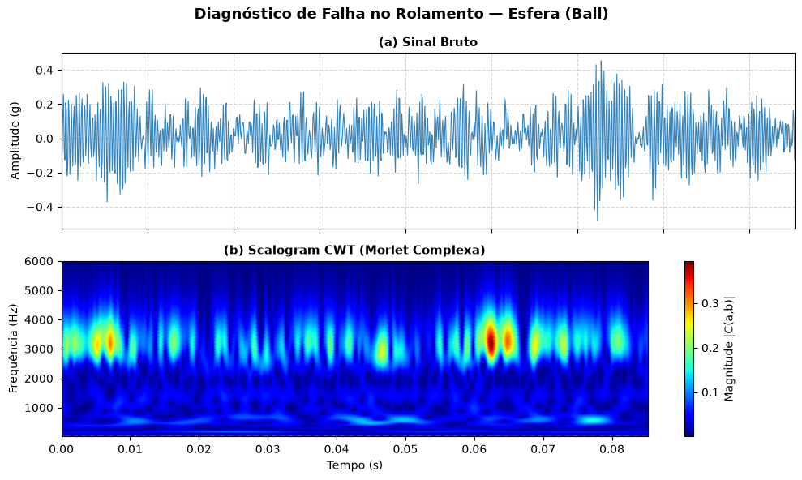
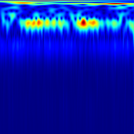
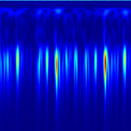
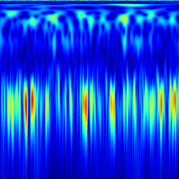
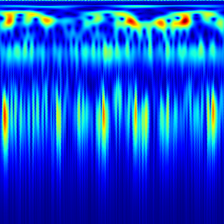
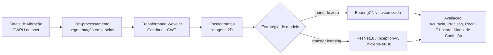
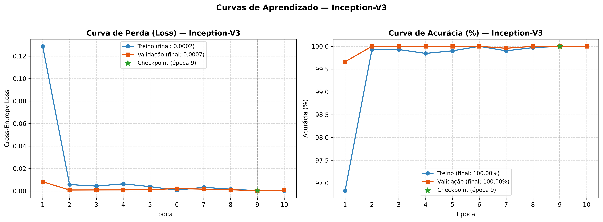
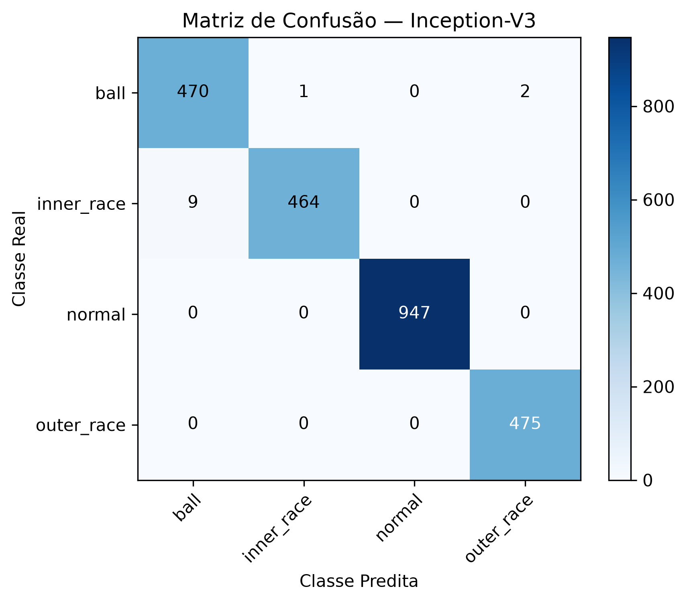

# Diagnóstico de Falhas em Rolamentos com CWT + CNN

Transformada Wavelet Contínua e Redes Neurais Convolucionais aplicadas ao diagnóstico de falhas em rolamentos industriais.

[](https://www.python.org/)
[](https://pytorch.org/)
[](https://engineering.case.edu/bearingdatacenter)
[](LICENSE)


---

## Sumário

- [Visão geral](#visão-geral)
- [Justificativa técnica: CWT vs. FFT vs. STFT](#justificativa-técnica-cwt-vs-fft-vs-stft)
- [Escalogramas por classe](#escalogramas-por-classe)
- [Pipeline](#pipeline)
- [Resultados](#resultados)
- [Estrutura do repositório](#estrutura-do-repositório)
- [Instalação](#instalação)
- [Uso](#uso)
- [Modelos de Transfer Learning](#modelos-de-transfer-learning)
- [Base teórica](#base-teórica)
- [Roadmap](#roadmap)
- [Autor](#autor)
- [Licença](#licença)

---

## Visão geral

Rolamentos são responsáveis por mais de 30% das falhas em máquinas elétricas rotativas, o que torna o diagnóstico precoce um requisito central de manutenção preditiva industrial. Este projeto implementa um pipeline de diagnóstico de falhas que combina:

- **Transformada Wavelet Contínua (CWT)** para converter sinais de vibração unidimensionais em representações tempo-frequência bidimensionais (escalogramas), capturando a natureza não estacionária das falhas;
- **Redes Neurais Convolucionais (CNN)** — treinadas do zero e via Transfer Learning (ResNet18, Inception-v3, EfficientNet-B0) — para classificação automática dos escalogramas gerados.

O trabalho utiliza o dataset público **CWRU** (Case Western Reserve University), benchmark consolidado na literatura de diagnóstico de falhas em rolamentos, contemplando condições de operação normal e falhas na pista interna, pista externa e elemento rolante.

O relatório técnico completo (fundamentação teórica, metodologia e resultados) está disponível em [`docs/TCC.pdf`](docs/TCC.pdf).

---

## Justificativa técnica: CWT vs. FFT vs. STFT

| Característica | FFT | STFT | CWT |
|---|:---:|:---:|:---:|
| Domínio de análise | Frequência | Tempo-frequência | Tempo-frequência |
| Tipo de janela | Sinal inteiro | Fixa | Adaptativa |
| Resolução temporal | Nenhuma | Fixa | Variável |
| Resolução em frequência | Fixa | Fixa | Variável |
| Adequação a sinais não estacionários | Inadequada | Parcial | Adequada |

Falhas em rolamentos geram sinais não estacionários, com eventos transitórios que a FFT não consegue localizar no tempo. A CWT contorna essa limitação ao adaptar dinamicamente sua janela de análise — janelas estreitas para altas frequências (maior resolução temporal) e janelas largas para baixas frequências (maior resolução espectral).

<p align="center">
  
</p>
<p align="center"><sub>Sinal de vibração bruto no domínio do tempo e escalograma correspondente, obtido pela CWT com a wavelet-mãe de Morlet.</sub></p>

---

## Escalogramas por classe

Cada classe de falha produz uma assinatura característica no escalograma, o que torna o problema adequado à classificação por CNN.

<p align="center">
  
  
  
  
</p>
<p align="center"><sub>Da esquerda para a direita: condição normal, falha na pista interna, falha na pista externa, falha no elemento rolante.</sub></p>

---

## Pipeline



---

## Resultados

Resultados obtidos nos testes em 2.368 amostras inéditas do conjunto de teste, com **divisão estrita por arquivos `.mat`** (prevenindo *Data Leakage* por sobreposição de janelas) e checkpointing automático pelo menor `val_loss`:

| Modelo | Estratégia | Acurácia (teste) | Parâmetros |
|---|---|:---:|:---:|
| **BearingCNN (Própria)** | Treino do zero | **93.12%** | ~25.6M |
| **ResNet18** | Fine-tuning (`Freeze=False`) | **98.40%** | ~11.1M |
| **EfficientNet-B0** | Fine-tuning (`Freeze=False`) | **99.37%** | ~5.3M |
| **Inception-v3** | Fine-tuning (`Freeze=False`) | **99.49%** | ~23.8M |

> [!NOTE]
> A divisão do dataset é realizada por **arquivos `.mat` inteiros** (e não por janelas individuais), garantindo que nenhuma amostra compartilhada por sobreposição (overlap de 50%) esteja presente nos conjuntos de treino e teste simultaneamente. Isso comprova a capacidade real de generalização dos modelos de Transfer Learning (até 99.49%) em comparação à CNN customizada (93.12%).

<p align="center">
  <b>Curvas de Aprendizado (Perda e Acurácia — Inception-v3)</b><br>
  
</p>

<p align="center">
  <b>Matriz de Confusão no Teste Inédito (Inception-v3 — 99.49% de Acurácia)</b><br>
  
</p>

---

## Estrutura do repositório

```
bearing-fault-diagnosis-cwt-cnn/
├── data/                      # Dataset CWRU bruto (.mat) e processado (/processed)
├── notebooks/                 # Notebooks interativos do projeto
│   ├── cwru_exploracao_cwt.ipynb      # Análise exploratória e geração da Figura 5
│   ├── cwru_treinamento_cnn.ipynb     # Treinamento da BearingCNN própria (99.89%)
│   └── cwru_transfer_learning.ipynb   # Experimentos de Transfer Learning (100.00%)
├── src/
│   ├── config.py               # Configurações globais (caminhos, hiperparâmetros, número de classes)
│   ├── dataset.py              # Carregamento dos arquivos .mat do CWRU e janelamento
│   ├── cwt_processor.py        # Cálculo da CWT e exportação dos escalogramas 224x224
│   ├── visualization.py        # Geração de gráficos no padrão da Monografia (Figura 5)
│   ├── generate_dataset.py     # Script para geração automatizada do dataset de imagens
│   ├── cnn_processor.py        # Arquitetura BearingCNN e motor de treino da rede própria
│   └── transfer_learning.py    # Construtores e motor de treino para ResNet18/Inception-v3/EfficientNet-B0
├── docs/
│   ├── TCC.pdf                 # Relatório técnico completo do trabalho
│   └── images/                 # Figuras utilizadas neste README
├── requirements.txt
├── LICENSE
└── README.md
```

---

## Instalação

```bash
git clone https://github.com/jvkauer/bearing-fault-diagnosis-cwt-cnn.git
cd bearing-fault-diagnosis-cwt-cnn

python -m venv venv
source venv/bin/activate   # Windows: venv\Scripts\activate

pip install -r requirements.txt
```

### Dataset

Os dados brutos de vibração são fornecidos publicamente pela [CWRU Bearing Data Center](https://engineering.case.edu/bearingdatacenter). Baixe os arquivos `.mat` e posicione-os nas pastas correspondentes em `data/` (`ball`, `inner_race`, `normal`, `outer_race`) conforme indicado em `src/config.py`.

---

## Uso

**1. Gerar os escalogramas a partir dos sinais brutos:**

```bash
python src/generate_dataset.py
```

**2. Treinar o modelo de Transfer Learning via script ou notebook:**

```python
from src.transfer_learning import train_and_evaluate_transfer_model

resultado = train_and_evaluate_transfer_model(
    model_name="resnet18",   # "resnet18" | "inception_v3" | "efficientnet_b0"
    num_epochs=10,
    lr=1e-3,
    freeze=False             # True para Feature Extraction, False para Fine-Tuning
)

print(f"Acurácia no teste: {resultado['test_acc']:.2f}%")
```

O pipeline realiza checkpointing automático do melhor modelo (menor `val_loss`) e retorna histórico de treino, predições de teste e métricas para análise posterior.

---

## Modelos de Transfer Learning

| Arquitetura | Camadas | Parâmetros (total) | Característica principal |
|---|:---:|:---:|---|
| ResNet18 | 18 | ~11M | Blocos residuais (shortcut connections) |
| Inception-v3 | 42 | ~24M | Módulos paralelos com kernels de múltiplos tamanhos |
| EfficientNet-B0 | variável | ~5M | Escalonamento composto (profundidade/largura/resolução) |

Todos os modelos são inicializados com pesos pré-treinados no ImageNet e adaptados ao problema por meio de feature extraction (backbone congelado) ou fine-tuning.

---

## Base teórica

Projeto fundamentado em literatura consolidada de processamento de sinais e aprendizado profundo, incluindo os trabalhos de Boudiaf et al. (2016), Guo et al. (2018), Wang et al. (2019) e Kaya, Kuncan & Ertunç (2022) — que reportam acurácias de até 99–100% combinando CWT com transfer learning. Os fundamentos matemáticos completos (FFT, STFT, CWT, arquiteturas de CNN) estão documentados no [Relatório Técnico (TCC)](docs/TCC.pdf).

---

## Roadmap

- [x] Revisão teórica e definição da metodologia
- [x] Pipeline de pré-processamento (CWT → escalogramas)
- [x] CNN treinada do zero (`BearingCNN` - **93.12%** de acurácia no teste)
- [x] Transfer Learning (`ResNet18`, `Inception-v3`, `EfficientNet-B0` - até **99.49%** de acurácia no teste)
- [x] Comparação sistemática de resultados entre arquiteturas
- [ ] Validação em banco de dados de falhas reais (NASA IMS / Paderborn - TCC 2)

---

## Autor

**João Vitor Kauer Schuck**  
Engenharia de Computação — Universidade Federal de Pelotas (UFPel)  
[GitHub: jvkauer](https://github.com/jvkauer)

---

## Licença

Distribuído sob a licença [MIT](LICENSE).
